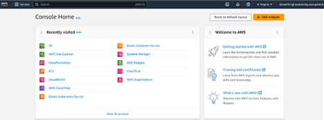

# STORAGE S3

## Background

Amazon S3 is object storage service built to store and retrieve any amount of data from anywhere. S3 is a simple storage service that offers industry leading durability, availability, performance, security, and virtually unlimited scalability at very low costs.

Amazon S3 provides a simple web service interface that you can use to store and retrieve any amount of data, at any time, from anywhere. Using this service, you can easily build applications that make use of cloud native storage.

## Prerequisite

For this mini-project, you need an AWS account. 

Set up a Free-Tier account www.aws.amazon.com/free.

## Project Outline

Create a Private S3 bucket and copy a file into it using the AWS console or AWS CLI.

Now let’s have fun “practicing”.

### Part 1: Create your first bucket

•	After creating your free tier AWS account, sign in to the AWS Management Console.

{: width="100%"}

•	Search S3 and open the Amazon S3 console.

•	In the left navigation pane, choose Buckets or choose Create bucket (orange rectangle) at your right.

 

•	The Create bucket page opens. Fill out the form (Bucket name, AWS Region, etc.). See bucket naming convention.

 

•	From there you can leave everything checked by default. If you want to make changes and choose what you want to apply, make sure to read this for more.

 
•	Last, choose Create bucket. You have created your first bucket successfully.

####     Cheat Sheet: 

        For Region, choose the AWS Region where you want the bucket to reside. To minimize latency and costs and address regulatory requirements, choose a Region close to you.

 
### Part 2: Upload a file into the file using the AWS console or AWS CLI.

After creating a bucket in Amazon S3, it’s time to upload an object to the bucket. An object can be any kind of file (a text file, a photo, a video).

•	Go to the Buckets list, and choose the name of the bucket that you created to upload your object to.

•	On the Objects tab for your bucket, choose Upload.

•	Under Files and folders, choose Add files.

 
•	Select a file to upload, and select Open. Then select Upload.

You’ve successfully uploaded an object to your bucket.

 
Voilà! You have created a S3 bucket and uploaded an object to it using AWS console.

Thank you for reading and/or following along! 
Want to see more tutorials and how-to guides like this one, check my website: [www.cloudwithdj.com](https://cloudwithdj.com/tutorial/) 

