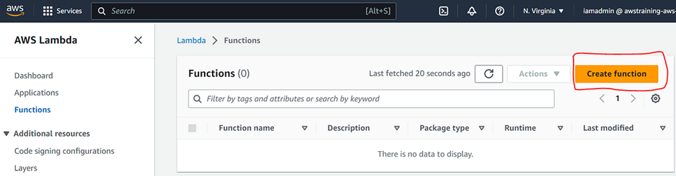
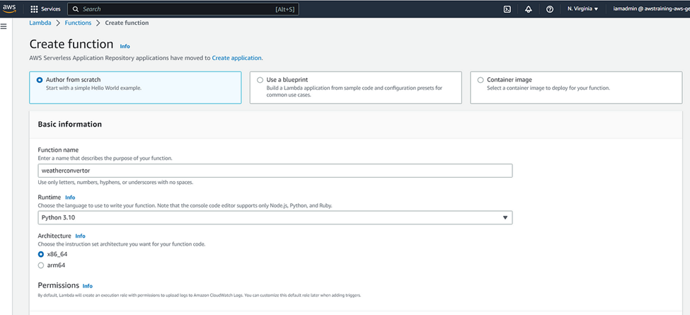
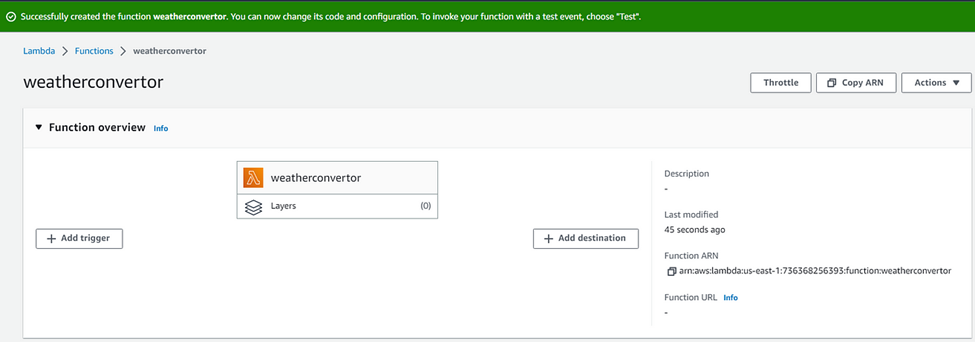
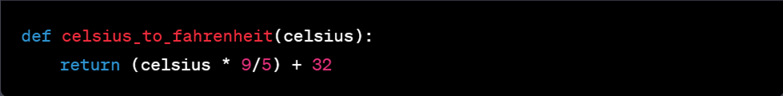
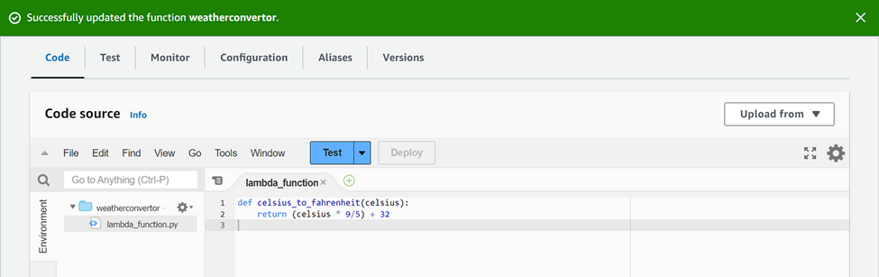
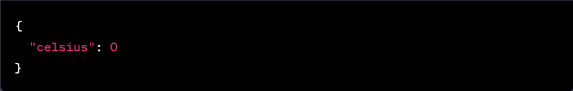

# Lambda
 
## Background

AWS Lambda is a serverless computing service provided that allows developers to run code without provisioning or managing servers. With AWS Lambda, developers can write code in a variety of programming languages, such as Python, Node.js, Java, and C#, and upload it to the AWS Lambda service, which takes care of executing the code and scaling it automatically based on the incoming requests.

When a function is deployed on AWS Lambda, it is triggered by an event, such as an HTTP request, a change to a database, or a file upload. The function runs in a container that is automatically provisioned by AWS Lambda and billed in 100-millisecond increments, based on the amount of memory allocated to the function.

## Prerequisite

For this project, you need an AWS account. Set up a Free-Tier account www.aws.amazon.com/free.

## Project Outline

Create a Lambda function that converts Celsius to Fahrenheit.

## Steps

-	After creating your free tier AWS account, sign in to the AWS Management Console.

-	Open the AWS Lambda console and click on the “Create function” button.

 
-	Choose “Author from scratch” as the blueprint.

-	In the “Basic information” section, give your function a name and select the runtime as “Python 3.10” or any other version you prefer.

-	Under “Permissions”, select “Create a new role with basic Lambda permissions” and give it a name.

-	Click on the “Create function” button.

 
-	In the function code section, click on lambda_function.py, select and replace the existing code with the following Python code:

 
Cheat Sheet: This function takes a temperature in Celsius as input and returns the equivalent temperature in Fahrenheit.

-	Click on “Deploy” to save the function code.

 
-	To test the function, click on “Test” and create a new test event.

-	Leave all the settings by default, but add the Event name and the following JSON code in the Event JSON.
 
 
 
Cheat Sheet: This represents a temperature of 0 degrees Celsius.

-	Click on “Test” to run the function and verify that it returns the correct result.
Cheat Sheet: Double check your lambda execution role, and your JSON code if it doesn’t work the first time.

Voilà! You have now created a Lambda function that converts Celsius to Fahrenheit! You can now use this function in your other AWS services or applications.

Thank you for reading and/or following along! Please stay tuned for all my upcoming projects, and feel free to check out the rest of my articles at www.fahmacloud.com.

