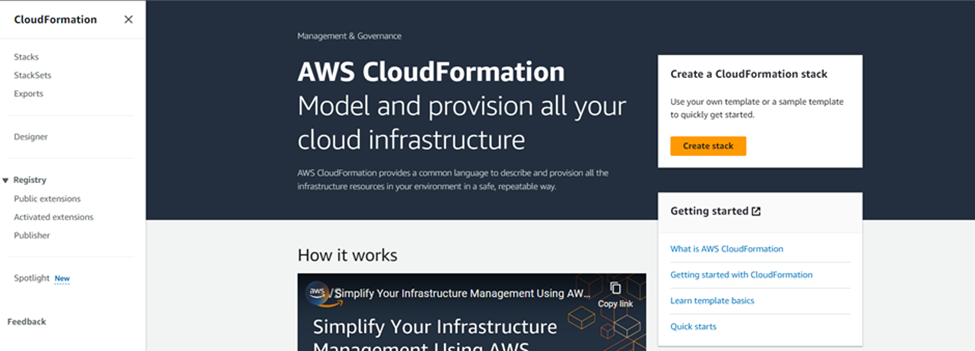
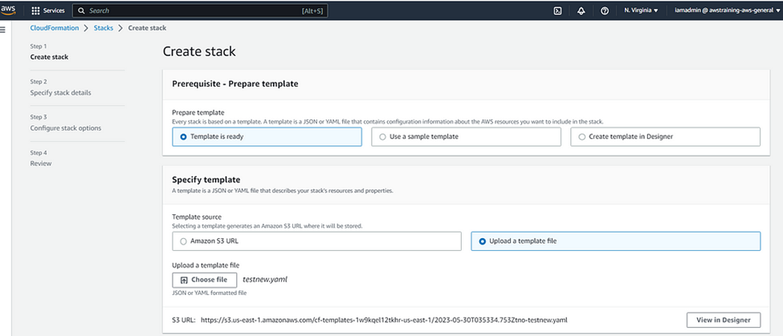
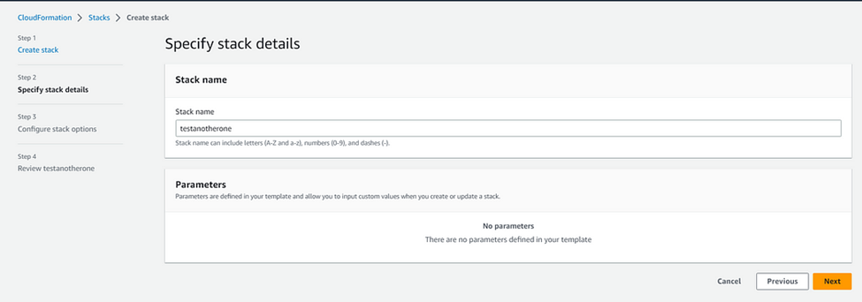
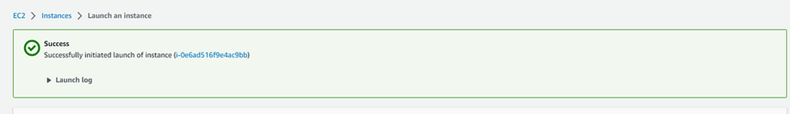

## How to launch an Amazon Linux 2 EC2 instance using CloudFormation

Amazon Linux 2 supports the latest EC2 instance capabilities and is tuned for optimal performance on AWS.
 
### Background

Amazon Linux 2 is a Linux operating system from AWS that provides a security-focused, stable, and high-performance execution environment to develop and run cloud applications. Amazon Linux 2 is provided at no additional charge.

Using CloudFormation to launch an EC2 instance allows you to automate the infrastructure provisioning process and easily replicate the deployment in the future.

### Prerequisite

For this project, you need an AWS account. Set up a Free-Tier account www.aws.amazon.com/free.

### Project Outline

We’ll provide the steps by steps to launch an Amazon Linux 2 EC2 instance using CloudFormation.

### Steps

#### Step 1: Create a YAML or JSON script

•	Open your favorite code editor.

•	Create a YAML or JSON template that describes the resources you want to create, including the EC2 instance.

Cheat Sheet: 
Make sure to add Image Id of the AMI, the key pair, CidrIp, VPC and subnets in the script.

•	Save the template to a file on your local machine with a .yaml or .json extension.

#### Step 2: Create a CloudFormation Template

•	Open the AWS Management Console.

•	Go to the CloudFormation service in the AWS Management Console.

 
•	Click on the “Create stack” button to start the stack creation process.

•	Choose “Upload a template file” and click “Choose file”. Select the CloudFormation template file you saved in step 1.

 
•	Provide a stack name for your EC2 instance and specify any additional parameters required by your template (if any).

 
•	Configure any additional stack options such as tags, permissions, and advanced settings.

•	Review the stack details and click “Create stack” to launch the EC2 instance.

•	Monitor the stack creation process in the CloudFormation console. 

The status will change to “CREATE_COMPLETE” once the stack is created successfully.

When the stack is created, you can access your EC2 instance using SSH or other remote access methods using the key pair specified in the CloudFormation template.

Voilà! You have launched an Amazon Linux 2 EC2 Instance using CloudFormation.
 

